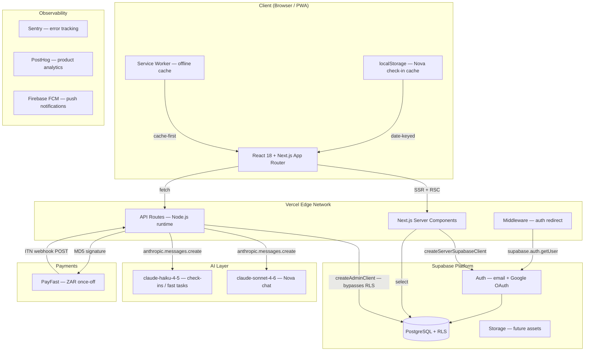
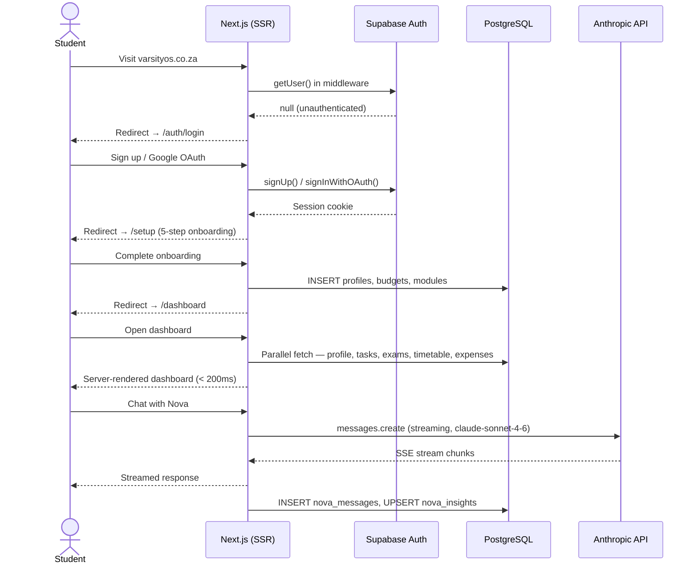
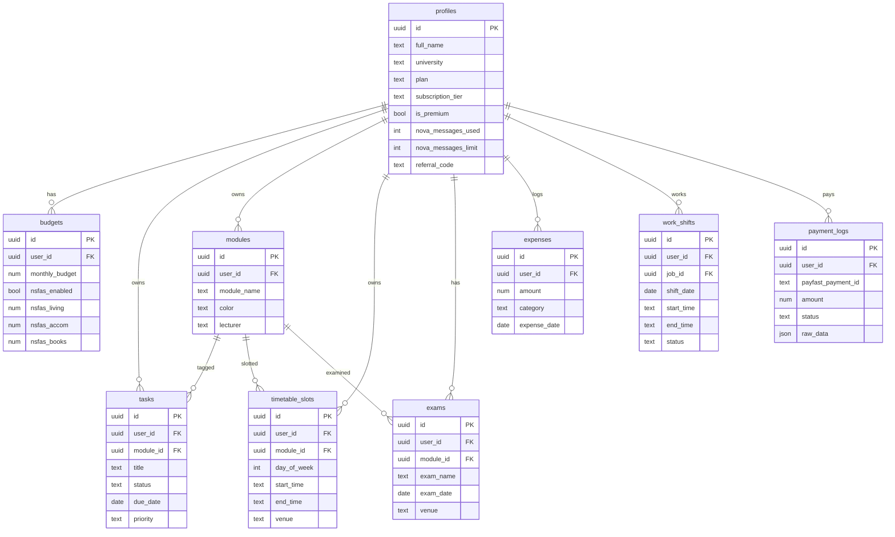
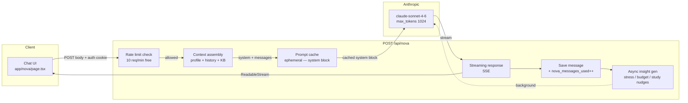
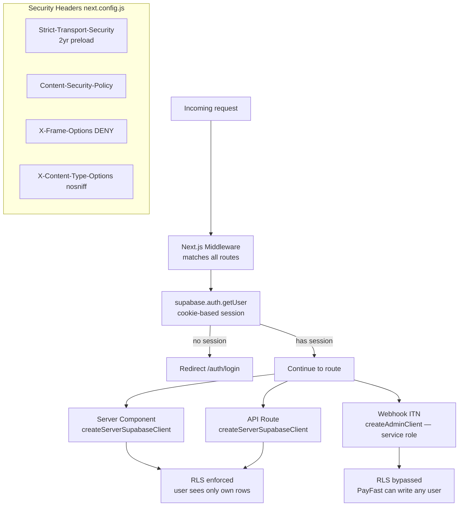
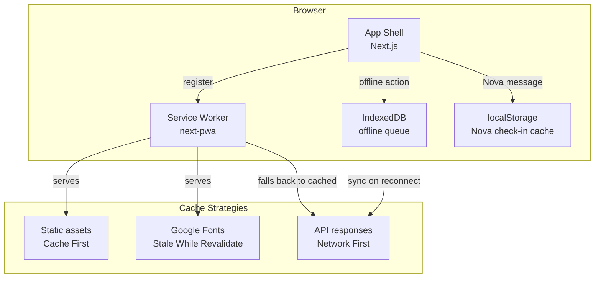
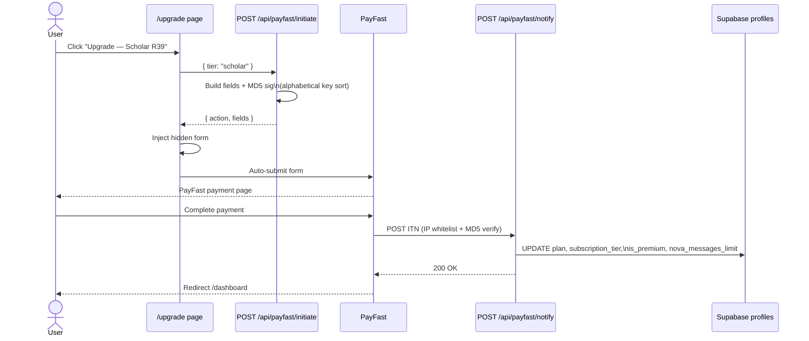

# VarsityOS — System Design

> SA student super-app: AI companion, budget, study planner, meal prep, work tracker.  
> Stack: Next.js 14 · Supabase · Anthropic · PayFast · Vercel

---

## 1. High-Level Architecture

---

## 2. User Journey

---

## 3. Database ERD (Core Tables)

---

## 4. Nova AI Pipeline

---

## 5. Auth & Security

---

## 6. Offline PWA Architecture

---

## 7. Payment Flow

